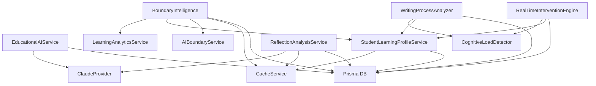

# AI Services Architecture Analysis - Scribe Tree Backend

## Executive Summary

The Scribe Tree backend AI services architecture consists of 13 specialized services in the `/backend/src/services/ai/` directory, with an existing MCP (Model Context Protocol) server implementation for educational AI validation. The services are tightly coupled through shared database access (Prisma ORM), inter-service dependencies, and a common caching layer.

## Current Architecture Overview

### Core AI Services

1. **EducationalAIService** (Orchestrator)
   - Central service that coordinates AI interactions
   - Manages Claude API integration through provider pattern
   - Validates educational compliance for all AI responses
   - Tracks AI interactions in database

2. **BoundaryIntelligence** 
   - Analyzes class performance and boundary effectiveness
   - Recommends boundary adjustments (class-wide and individual)
   - Monitors AI dependency patterns
   - Heavy database queries for analytics

3. **WritingProcessAnalyzer**
   - Analyzes writing patterns and student behavior
   - Identifies dominant writing patterns (linear, recursive, exploratory, etc.)
   - Generates process insights and recommendations
   - Cross-assignment pattern analysis

4. **CognitiveLoadDetector**
   - Real-time behavioral analysis from writing sessions
   - Detects cognitive overload from deletion ratios, pauses, cursor movement
   - Provides load estimations and contributing factors
   - No external dependencies, pure calculation service

5. **RealTimeInterventionEngine**
   - Decides when/how to intervene based on cognitive load
   - Generates educational interventions (prompts, questions, breaks)
   - Tracks intervention effectiveness
   - Manages cooldown periods and intervention limits

6. **StudentLearningProfileService**
   - Builds comprehensive student profiles from multiple data sources
   - Tracks preferences, strengths, current state, independence metrics
   - Heavy database aggregation across multiple tables
   - Cached for performance (5-minute TTL)

7. **ReflectionAnalysisService**
   - Analyzes student reflections for quality and depth
   - Generates reflection scores and insights
   - Integrates with Claude API for analysis
   - Results cached for 30 minutes

8. **Other Specialized Services**
   - **AcademicIntegrityService**: Plagiarism and integrity checks
   - **AuthenticityDetector**: Detects AI-generated content
   - **ExternalAIDetectionService**: Identifies external AI tool usage
   - **EducatorAlertService**: Manages educator notifications
   - **AutoAdjustmentEngine**: Proposes automatic boundary adjustments
   - **MCPValidationService**: Integrates with MCP server

### Service Dependencies



### Shared Dependencies

1. **Database Access (Prisma)**
   - All services directly import and use `prisma` client
   - No abstraction layer or repository pattern
   - Direct table access: `AIInteractionLog`, `WritingSession`, `ReflectionAnalysis`, `StudentProfile`, etc.

2. **Caching Layer**
   - In-memory `CacheService` with TTL support
   - Key patterns for different data types
   - 5-30 minute cache durations
   - No distributed cache support

3. **External APIs**
   - Claude API (through `ClaudeProvider`)
   - Environment-based configuration
   - No other AI provider implementations

4. **Common Interfaces**
   - `AIProviderInterface`: Abstraction for AI providers
   - `EducationalContext`, `WritingStage`, `CognitiveLoadIndicators`
   - Shared types across services

### Inter-Service Communication

- **Direct method calls**: Services import and call each other directly
- **No message queue**: Synchronous communication only
- **No event system**: No pub/sub or event-driven architecture
- **Shared state**: Through database and cache

### Existing MCP Server

The `educational-ai-validator` MCP server provides:
- 8 validation tools for educational AI compliance
- Bloom's taxonomy analysis
- Dependency risk detection
- Philosophy enforcement
- Progressive access validation
- Runs on stdio protocol
- TypeScript implementation with full type safety

## Key Findings

### Coupling Issues

1. **Database Coupling**
   - Every service has direct Prisma imports
   - Complex queries scattered across services
   - No query optimization or batching strategy
   - Migration would require significant refactoring

2. **Service Interdependencies**
   - `BoundaryIntelligence` depends on 4 other services
   - `WritingProcessAnalyzer` creates `CognitiveLoadDetector` instances
   - Circular dependency risks with profile service

3. **Shared State Management**
   - Cache keys defined centrally but used everywhere
   - No cache invalidation strategy
   - Potential consistency issues

### Scalability Concerns

1. **Synchronous Processing**
   - All operations are synchronous
   - Long-running analytics block requests
   - No background job processing

2. **Memory-Based Caching**
   - Single-instance cache
   - Lost on restart
   - Not suitable for distributed deployment

3. **Database Load**
   - Heavy aggregation queries
   - No read replicas support
   - Missing database indexes (based on slow query logging)

### Microservices Migration Challenges

1. **Data Access Patterns**
   - Services expect immediate database access
   - Complex joins and aggregations
   - Would need API gateway or data federation

2. **Transaction Boundaries**
   - Some operations span multiple tables
   - No distributed transaction support
   - Data consistency concerns

3. **Performance Impact**
   - Network latency between services
   - Data serialization overhead
   - Cache distribution complexity

## Recommendations for Microservices Architecture

### Phase 1: Decouple and Modularize

1. **Extract Pure Calculation Services First**
   - `CognitiveLoadDetector` (no DB dependencies)
   - Bloom's taxonomy analysis
   - Pattern detection algorithms

2. **Create Repository Layer**
   - Abstract database access
   - Define clear data contracts
   - Enable easier service extraction

3. **Implement Event System**
   - Replace direct service calls with events
   - Enable asynchronous processing
   - Decouple service dependencies

### Phase 2: Service Extraction Priority

1. **High Priority** (Low coupling, high value)
   - MCP validation services (already separate)
   - Cognitive load detection
   - Intervention engine (with API-based data access)

2. **Medium Priority** (Moderate coupling)
   - Student profile service (with caching strategy)
   - Reflection analysis (with queue-based processing)
   - Writing process analyzer

3. **Low Priority** (High coupling, complex state)
   - Boundary intelligence (requires major refactoring)
   - Educational AI orchestrator (core dependency)

### Phase 3: Infrastructure Requirements

1. **API Gateway**
   - Route requests to appropriate services
   - Handle authentication/authorization
   - Aggregate responses

2. **Message Queue** (RabbitMQ/Kafka)
   - Asynchronous processing
   - Event-driven architecture
   - Service decoupling

3. **Distributed Cache** (Redis)
   - Shared state management
   - Session storage
   - Performance optimization

4. **Service Mesh** (Optional)
   - Service discovery
   - Load balancing
   - Circuit breakers

### Proposed Microservices Architecture

```
┌─────────────────┐     ┌─────────────────┐     ┌─────────────────┐
│   API Gateway   │────▶│  Load Balancer  │────▶│  Service Mesh   │
└─────────────────┘     └─────────────────┘     └─────────────────┘
         │                                                │
         ▼                                                ▼
┌─────────────────┐     ┌─────────────────┐     ┌─────────────────┐
│  Auth Service   │     │ Student Profile │     │ Cognitive Load  │
│  (Existing)     │     │    Service      │     │    Service      │
└─────────────────┘     └─────────────────┘     └─────────────────┘
         │                       │                        │
         ▼                       ▼                        ▼
┌─────────────────┐     ┌─────────────────┐     ┌─────────────────┐
│   AI Gateway    │     │ Writing Process │     │  Intervention   │
│    Service      │     │    Service      │     │    Service      │
└─────────────────┘     └─────────────────┘     └─────────────────┘
         │                       │                        │
         ▼                       ▼                        ▼
┌─────────────────┐     ┌─────────────────┐     ┌─────────────────┐
│ Claude Provider │     │   Reflection    │     │    Boundary     │
│    Service      │     │    Service      │     │    Service      │
└─────────────────┘     └─────────────────┘     └─────────────────┘
         │                       │                        │
         ▼                       ▼                        ▼
    ┌─────────────────────────────────────────────────────┐
    │                  Message Queue                       │
    │                (RabbitMQ/Kafka)                     │
    └─────────────────────────────────────────────────────┘
         │                       │                        │
         ▼                       ▼                        ▼
┌─────────────────┐     ┌─────────────────┐     ┌─────────────────┐
│  Redis Cache    │     │   PostgreSQL    │     │ MongoDB (Logs)  │
│    Cluster      │     │    Primary      │     │    Cluster      │
└─────────────────┘     └─────────────────┘     └─────────────────┘
```

## Implementation Roadmap

### Month 1: Foundation
- Implement repository pattern for data access
- Create event system with RabbitMQ
- Extract CognitiveLoadDetector as first microservice
- Set up API gateway with Kong or similar

### Month 2: Core Services
- Extract StudentProfileService with Redis caching
- Migrate InterventionEngine with queue-based triggers
- Implement service discovery with Consul

### Month 3: Complex Services
- Refactor BoundaryIntelligence for distributed architecture
- Extract WritingProcessAnalyzer with event sourcing
- Implement distributed tracing with Jaeger

### Month 4: Integration
- Complete service mesh implementation
- Implement circuit breakers and retry logic
- Performance testing and optimization
- Migration strategy for existing data

## Conclusion

The current monolithic architecture has significant coupling issues that would make a direct microservices migration challenging. However, with a phased approach focusing on decoupling, event-driven architecture, and proper infrastructure, the migration is achievable. The existing MCP server demonstrates that some services are already designed with separation in mind, which provides a good starting point for the broader microservices transformation.